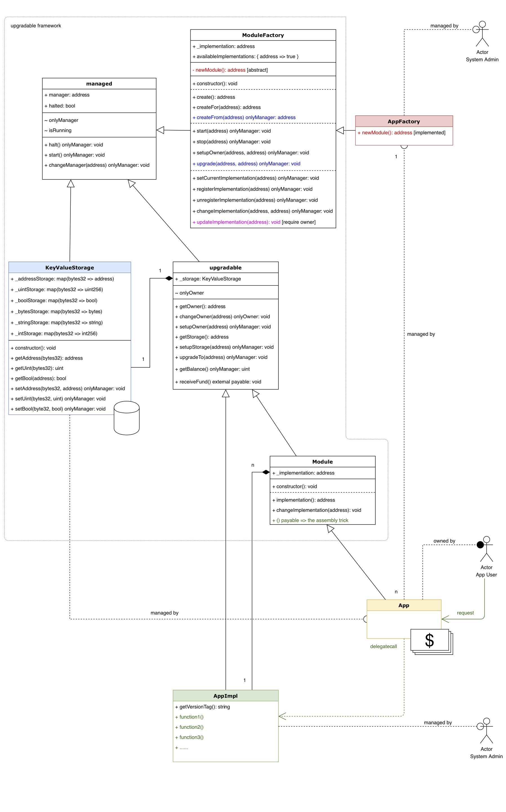

# Upgradable Contract Framework Proof-of-Concept

可升级合约框架proof-of-concept

以及在remix中验证的方法

## 文件

框架共6个solidity源码文件，位于./contracts/upgradable/：
1. ModuleFactory.sol 工厂（父合约）
1. Module.sol 主合约（父合约）
1. KeyValueStorage.sol KV存储
1. Upgradable.sol 升级功能
1. Managed.sol 管理功能

应用示例共3个solidity源码文件，位于./contracts/：
1. AppFactory.sol 工厂
1. App.sol 主合约
1. AppImpl.sol 业务逻辑

辅助功能1个文件，位于./contracts/：
* SafeMath.sol 安全计算（辅助）

## 类图

见 UpgradableContracts\*.jpg

## remix验证方法

### 准备工作

1. 打开http://remix.ethereum.org/
1. 把上述sol文件内容导入remix

### 部署合约

1. 【系统管理员】部署工厂：部署AppFactory，地址0xfactory
1. 【系统管理员】部署业务逻辑合约V1：部署AppImpl (versionTag = "0.0.1")，地址0ximplV1
1. 【系统管理员】向工厂登记业务逻辑V1并设为当前最新实现：调用0xfactory.setCurrentImplementation(0ximplV1)

### 主合约创建

1. 【任意用户】调用0xfactory.create()，创建App的实例，地址0xapp

### 验证主合约功能

1. 【任意用户】准备调用入口：使用remix的At Address方法，用AppImpl的原型 + 主合约的地址0xapp，新建一个调用入口（表现形式为一个deployed contract: AppImpl at 0xapp）
1. 【任意用户】使用调用入口进行验证：
	- getVersionTag() => 0.0.1
	- getBalance() => 0
	- 付款100000调用enable()，然后再getBalance() => 100000

### 验证软升级（只需1步）

软升级 soft upgrade = 只升级业务逻辑，不升级主合约，不升级KV存储

前置步骤：

1. 【系统管理员】部署业务逻辑合约V2：部署AppImpl (versionTag = "0.0.2")，地址0ximplV1
1. 【系统管理员】向工厂登记业务逻辑V2并设为当前最新实现：调用0xfactory.setCurrentImplementation(0ximplV2)

实施软升级：

1. 【主合约Owner】调用0xfactory.updateImplementation(0xapp)更新主合约的业务逻辑至最新版本的V2版业务逻辑

验证新业务逻辑：

1. 【任意用户】使用之前的调用入口进行验证：
	- getVersionTag() => 0.0.2
	- getBalance() => 100000

### 验证硬升级（只需2步）

硬升级 hard upgrade = 升级主合约（或升级框架），不升级KV存储，不变更业务逻辑

前置步骤：

1. 【系统管理员】部署新版本的工厂合约AppFactory（携带新版本的主合约App代码），地址0xfactoryNEW

实施硬升级：

1. 【系统管理员】调用新工厂0xfactoryNEW.createFrom(0xapp)，创建新版本主合约，地址0xappNEW，KV存储和业务逻辑自动继承过来
2. 【系统管理员】调用旧工厂0xfactory.upgrade(0xapp, 0xappNEW)，迁移资金等，完成升级

验证新版主合约功能：

1. 【任意用户】准备调用入口：使用remix的At Address方法，用AppImpl的原型 + 新版主合约的地址0xappNEW，新建一个新调用入口（表现形式为一个deployed contract: AppImpl at 0xappNEW）
1. 【任意用户】使用新调用入口进行验证：
	- getVersionTag() => 0.0.2
	- getBalance() => 100000
	- 付款100000调用enable()，然后再getBalance() => 200000
	
验证旧版合约已停用：

1. 【任意用户】使用旧调用入口进行验证：
	- getBalance() => 0
	- getStorage() => 0x0
	- 状态halted => true

## License
(c)2020 Evan Liu. MIT License.
