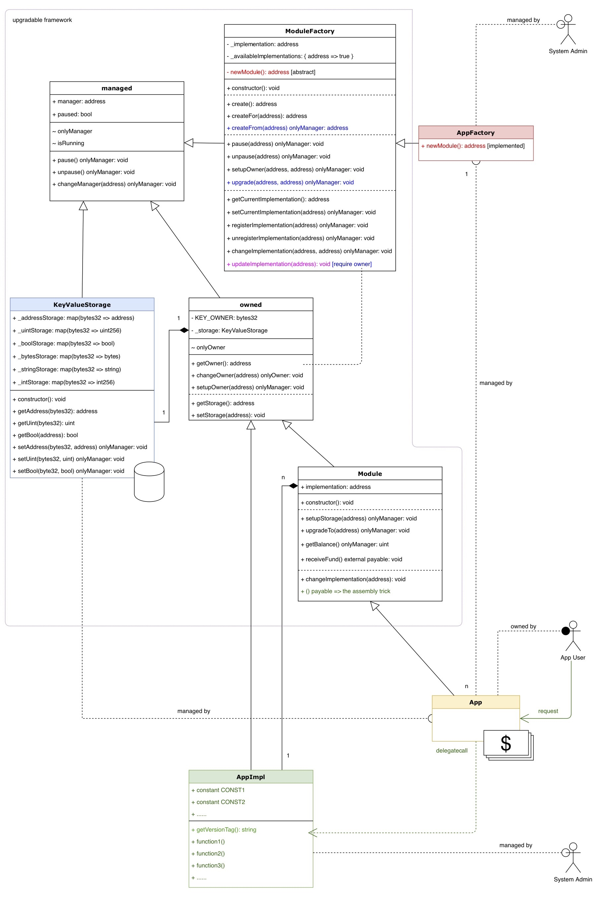

# Upgradable Contract Framework Proof-of-Concept

可升级合约框架proof-of-concept

以及用truffle和remix验证的方法

## 文件

框架共6个solidity源码文件，位于./contracts/upgradable/：
1. ModuleFactory.sol 工厂（父合约）
1. Module.sol 主合约（父合约） & (硬)升级功能
1. Managed.sol 合约管理者manager
1. Owned.sol 存储\_storage & 存储所有者owner
1. KeyValueStorage.sol KV存储

应用示例共3个solidity源码文件，位于./contracts/：
1. AppFactory.sol 工厂
1. App.sol 主合约
1. AppImpl.sol 业务逻辑v1
1. AppImpl2.sol 业务逻辑v2

外部库1个文件，位于./contracts/lib/：
* Membership.sol 成员相关函数，演示业务逻辑代码拆分
* SafeMath.sol 安全计算（辅助）

测试用例6个文件，位于./test/：
* 00\_managed.js     
* 01\_storage.js     
* 02\_owned.js       
* 03\_module.js      
* 10\_upgrade.js
* 11\_application.js

## 使用方法

1. 初始化项目目录
```
$ truffle init
```

2. 安装必要的库
```
$ npm install truffle-assertions
```

3. 把upgradable/下的框架源码放到contracts/目录下
```
truffle project
 |
 +- contracts
 |   |
 |   +- upgradable/*.sol
 |
 +- XXXFactory.sol
 +- XXX.sol
 +- XXXImpl.sol
```

4. 在contracts/目录下创建新应用模块（假设叫Todo）的主合约XXX.sol、工厂XXXFactory.sol以及业务逻辑实现XXXImpl.sol
```solidity
// Todo.sol

pragma solidity = 0.4.24;
import "./upgradable/Module.sol";

contract Todo is Module {
}
```

```solidity
// TodoFactory.sol

pragma solidity = 0.4.24;
import "./upgradable/ModuleFactory.sol";
import "./Todo.sol";

contract TodoFactory is ModuleFactory {
	function newModule() public returns (address) {
		return address(new Todo());
		}
}
```

```solidity
// TodoImpl.sol

pragma solidity = 0.4.24;
import "./SafeMath.sol";
import "./upgradable/Owned.sol";

contract TodoImpl is owned {
	
	// feel free to implement something

}

```

注意：

	1) 尽量把所有的业务相关定义和数据都写在XXXImpl.sol里，以便于软升级
	2) XXXImpl.sol只能定义constant和function，变量以及Event无效(待确认)


5. 针对不同模块编写测试用例，放在test/目录下，叫做test/20\_YYY.js


## 类图



## truffle验证方法

### 准备工作

安装truffle: 

```
$ npm install -g truffle
```

### 运行测试用例

```
$ truffle test
```

共25个用例，测试通过：

```
  Contract: Managed
    ✓ should the managed deployed()
    ✓ should onlyManager to changeManager while isRunning (334ms)

  Contract: Module
    ✓ should the Module deployed()
    ✓ should setup a new storage (115ms)
    ✓ should setup a legacy storage (146ms)
    ✓ should upgrade to a new module (372ms)
    ✓ should change implementation and route function calls (112ms)

  Contract: Owned
    ✓ should the owned deployed()
    ✓ should get/init the storage (172ms)
    ✓ should get/setup/change owner (279ms)

  Contract: KeyValueStorage
    ✓ should the storage deployed()
    ✓ should get/set address (72ms)
    ✓ should get/set uint (72ms)
    ✓ should get/set bool (68ms)
    ✓ should get/set string (75ms)
    ✓ should get/set bytes32 (63ms)
    ✓ should get/set int (65ms)

  Contract: AppFactory
    ✓ should create an App that has the AppImpl (216ms)
    ✓ should soft upgrade from AppImpl to AppImpl2 (197ms)
    ✓ should create then create again succeeds (474ms)
    ✓ should hard upgrade App v1 to App v2 (334ms)

  Contract: App
    ✓ should have the version tag 0.0.1 (209ms)
    ✓ should enable an App (53ms)
    ✓ should set/get number of members (64ms)
    ✓ should check isMember and isAdmin (45ms)
```

## remix验证方法

### 准备工作

1. 打开http://remix.ethereum.org/
1. 把上述sol文件内容导入remix

### 部署合约

1. 【系统管理员】部署工厂：部署AppFactory，地址0xfactory
1. 【系统管理员】部署业务逻辑合约V1：部署AppImpl (versionTag = "0.0.1")，地址0ximplV1
1. 【系统管理员】向工厂登记业务逻辑V1并设为当前最新实现：调用0xfactory.setCurrentImplementation(0ximplV1)

### 主合约创建

1. 【任意用户】调用0xfactory.create()，创建App的实例，地址0xapp

### 验证主合约功能

1. 【任意用户】准备调用入口：使用remix的At Address方法，用AppImpl的原型 + 主合约的地址0xapp，新建一个调用入口（表现形式为一个deployed contract: AppImpl at 0xapp）
1. 【任意用户】使用调用入口进行验证：
	- getVersionTag() => 0.0.1
	- getBalance() => 0
	- 付款100000调用enable()，然后再getBalance() => 100000

### 验证软升级（只需1步）

软升级 soft upgrade = 只升级业务逻辑，不升级主合约，不升级KV存储

前置步骤：

1. 【系统管理员】部署业务逻辑合约V2：部署AppImpl (versionTag = "0.0.2")，地址0ximplV1
1. 【系统管理员】向工厂登记业务逻辑V2并设为当前最新实现：调用0xfactory.setCurrentImplementation(0ximplV2)

实施软升级：

1. 【主合约Owner】调用0xfactory.updateImplementation(0xapp)更新主合约的业务逻辑至最新版本的V2版业务逻辑

验证新业务逻辑：

1. 【任意用户】使用之前的调用入口进行验证：
	- getVersionTag() => 0.0.2
	- getBalance() => 100000

### 验证硬升级（只需2步）

硬升级 hard upgrade = 升级主合约（或升级框架），不升级KV存储，不变更业务逻辑

前置步骤：

1. 【系统管理员】部署新版本的工厂合约AppFactory（携带新版本的主合约App代码），地址0xfactoryNEW

实施硬升级：

1. 【系统管理员】调用新工厂0xfactoryNEW.createFrom(0xapp)，创建新版本主合约，地址0xappNEW，KV存储和业务逻辑自动继承过来
2. 【系统管理员】调用旧工厂0xfactory.upgrade(0xapp, 0xappNEW)，迁移资金等，完成升级

验证新版主合约功能：

1. 【任意用户】准备调用入口：使用remix的At Address方法，用AppImpl的原型 + 新版主合约的地址0xappNEW，新建一个新调用入口（表现形式为一个deployed contract: AppImpl at 0xappNEW）
1. 【任意用户】使用新调用入口进行验证：
	- getVersionTag() => 0.0.2
	- getBalance() => 100000
	- 付款100000调用enable()，然后再getBalance() => 200000
	
验证旧版合约已停用：

1. 【任意用户】使用旧调用入口进行验证：
	- getBalance() => 0
	- getStorage() => 0x0
	- 状态halted => true

## References

1. [solidity官方文档](https://solidity.readthedocs.io/)
1. [web3js官方文档](https://web3js.readthedocs.io/)
2. [truffle官方文档](https://www.trufflesuite.com/docs/truffle/overview)

## License
(c)2020 Evan Liu. MIT License.
