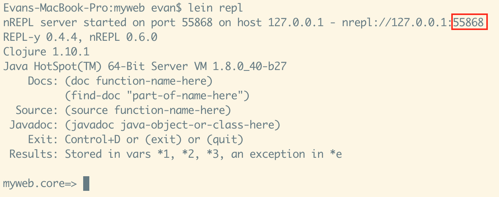
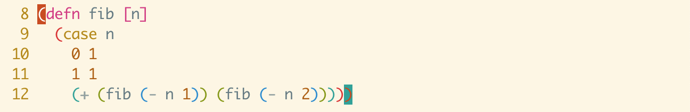
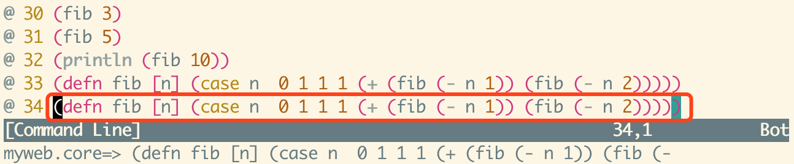
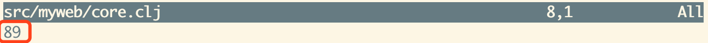
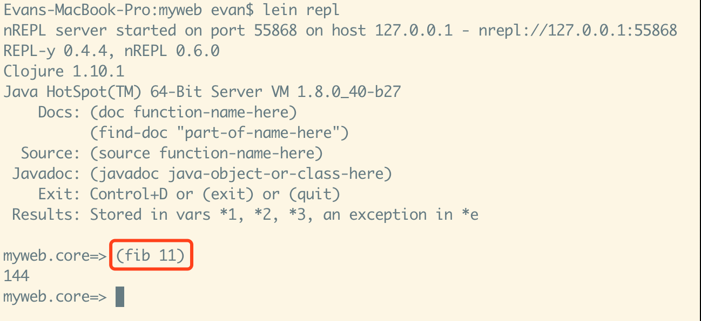
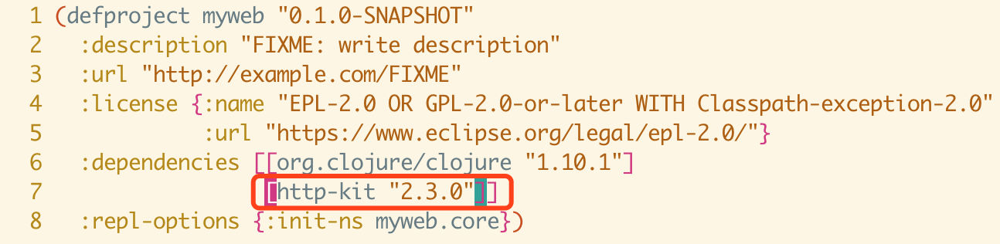
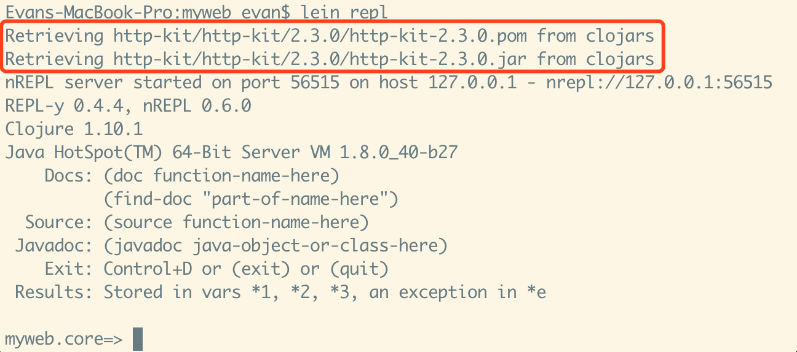
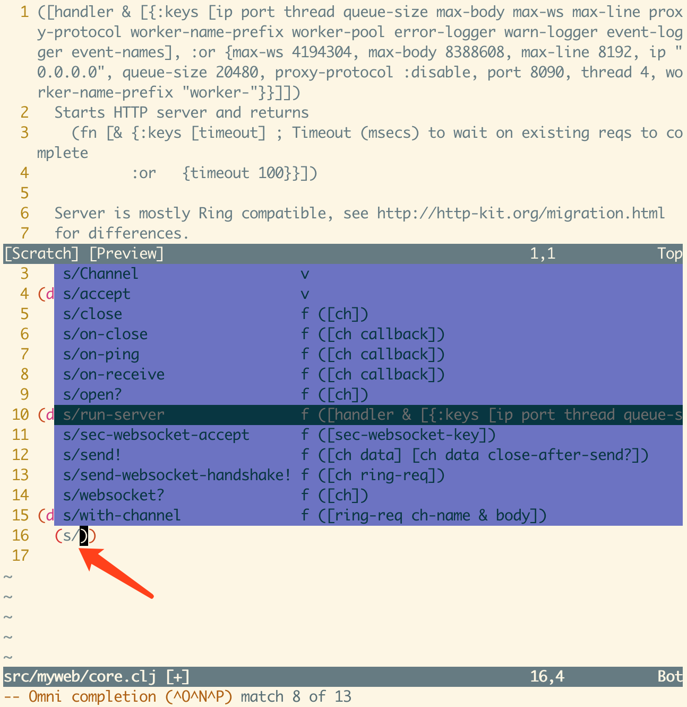

# 1小时掌握clojure交互式开发方法

clojure具有独特的交互式开发方法，具体架构是：
```
                    +-----------+
                    |    vim    |<-包管理：vundle
    +- Terminal 1 --+-----------+
H   |               | fireplace | * 自动连接REPL
A   |               +-----+-----+
C---+                     |
K---+        ({project}/target/repl-port)
E   |                     |
R   |               +-----+-----+
    |               |   REPL    |
    +- Terminal 2 --+-----------+
   必须在项目目录启动->| lein repl |<-包来源：maven & clojars 
                    +-----------+
```

## 安装leiningen包管理和build工具

下载安装脚本lein
```
$ wget https://raw.githubusercontent.com/technomancy/leiningen/stable/bin/lein
```

把脚本放到/usr/local/bin
```
$ chmod a+x lein
$ mv lein /usr/local/bin
```

运行脚本，开始下载安装包
```
$ lein
```

### 常见问题

Q: 下载速度太慢，怎么办？
A: 用v2ray加速。Manual Mode (supporse http listening port is 11087)。
```
$ export https_proxy=http://127.0.0.1:11087
$ lein
```

Q: 下载后提示checksum不匹配，无法正常安装？
A: 参考[这篇stackoverflow帖子的方法](https://stackoverflow.com/questions/25225241/failing-to-download-leiningen-standalone-jar-file)。具体的：
- 编辑上述已经放好的脚本/usr/local/bin/lein，找到
```
LEIN_JAR="$LEIN_HOME/self-installs/leiningen-$LEIN_VERSION-standalone.jar"
```
改为
```
LEIN_JAR="$LEIN_HOME/self-installs/leiningen-$LEIN_VERSION-standalone.zip"
```

再找到
```
LEIN_URL="https://github.com/technomancy/leiningen/releases/download/$LEIN_VERSION/leiningen-$LEIN_    VERSION-standalone.zip"
```
在这一句下面增加
```
echo $LEIN_URL
```
- 运行lein，复制显示出来的$LEIN_URL
- $ wget $LEIN_URL 手工下载下来，把zip文件拷贝到~/.lein/self-install/目录（如果没有则先创建）
- $ lein new FirstProject 试试看是否能够工作

## 准备工作：vim的配置

具体参考vim的相关教程

## 创建项目

创建项目myweb
```
$ lein new myweb
$ cd myweb
```

## 交互式开发

原理：
- 一个终端用lein repl启动REPL（必须在项目目录里启动），观察{project}/target/目录是否生成了一个repl-port文件，且内容就是REPL监听的端口（该端口在REPL启动后会显示在屏幕上）
- 另一个终端用vim进行编码，vim通过fireplace插件自动读取{project}/target/repl-port文件中的端口号并连接到REPL，一边写代码一边当场调试

### 启动REPL

开一个终端，进入myweb项目目录，运行lein repl
```
$ cd myweb
$ lein repl
```


注意监听端口是55868。查看一下 target/repl-port 文件内容应该正是这个端口号。

### 使用vim编写代码

另开一个终端，用vim编码
```
$ cd myweb
$ vim src/myweb/core.clj
```

Q: 如果关掉了repl重新启动，vim断掉了连接，如何重连？
A: 方法一：退出vim，重新启动vim
方法二：使用fireplace插件的vim命令 :Connect

### vim编码技巧：使用fireplace即时调试

编写一个函数fib


把cursor放在defn前面的开括号上（scope整个函数），确保处于vim的Normal Mode，连击 cqq ，在vim下方打开Command Line编辑区，检查内容正是希望发到REPL evaluate的东西，按回车发送。这一系列操作下文简称为 cqq {function}，比如上面这个操作就是 cqq fib。


现在fib函数的定义被发送到REPL并执行了！验证一下：在vim Normal Mode连击 cqp ，在vim下方打开REPL命令行输入，输入 (fib 10)

回车，REPL返回结果显示在vim下方：


全程不需要切换终端，写好一个函数就可以调试一个函数，遵循函数式编程的原则，尽量多定义pure function，最后再把他们组合起来，每个function编写的时候就已经调试好了，那么最后的程序质量也会很高。

切换到REPL所在的终端，也可以运行这个函数，非常方便：


### 引入第三方库

现在我们学习如何引入第三方库。

首先，引入第三方库需要重新启动REPL，以便于lein智能下载和按需加载该库。所以，让我们先把上面启动的REPL退出。在REPL里按 Ctrl+D 就可以了。

编辑project.clj文件，增加对http-kit库的依赖。


注：[http-kit: A high-performance event-driven HTTP client+server for Clojure 开源代码](https://github.com/http-kit/http-kit)

重新启动lein repl。会自动下载安装http-kit。


注：所有自动下载的依赖库都放在了标准的~/.m2/repository/目录下，并且位于lein repl可以按需加载的classpath路径中。

现在让我们来使用它。vim src/myweb/core.clj，在namespace定义中增加对http-kit的依赖导入：
```clojure
(ns myweb.core
  (:require [org.httpkit.server :as s]))
```

cursor放到ns前面的开括号，连击cqq，回车，使REPL立刻导入httpkit！

用下面的代码实现一个http服务器：
```clojure
;; handler就是一个能够返回map的函数
(defn handler [req]
  {:status 200
   :header ["Content-Type" "text/plain"]
   :body "Hi!"})

(defn create-server []
  (s/run-server handler {:port 8080}))

(defn stop-server [server]
  (server :timeout 100))
```

cqq handler, create-server, stop-server 把这三个函数发送到REPL。然后切换到REPL，让我们来启动服务器看看：


打开浏览器，访问一下 http://localhost:8080


回到REPL，停止服务器：


Tips: 使用REPL特殊变量 *1 让上述操作更简单：
```clojure
myweb.core=> (create-server)
#object[clojure.lang.AFunction$1 0x7a777fe2 "clojure.lang.AFunction$1@7a777fe2"]

myweb.core=> *1
#object[clojure.lang.AFunction$1 0x7a777fe2 "clojure.lang.AFunction$1@7a777fe2"]

myweb.core=> (stop-server *1)
nil
```

### vim编码技巧：使用omni completion智能补全

类似于Java IDE的智能提示，在vim Insert Mode（插入模式），输入 s/之后，连击 Ctrl+x Ctrl+o（Ctrl不松开，依次按x和o），效果如下：


可以上下选择想用的函数。甚至在上方（一个标准的vim分割窗口）还能看到该函数的文档（以后想随时在vim中查看文档，把cursor放到函数名上，在Normal Mode按下大写字母 K 即可，非常方便）。选好回车。

### vim编码技巧：使用paredit快速增删括号

我在.vimrc中定义的<Leader>按键是逗号键（，），下面讲连击的时候直接用逗号。

- 增加圆括号（成对）：Normal Mode选中文本后连击 ,W ，前后成对增加圆括号
- 增加其他括号（成对）：Normal Mode选中文本后连击 ,w[ 或者 ,w{  当然也可以 ,w( ，前后成对增加方括号、花括号或者圆括号（w = wrap包裹）
- 删除括号（成对）：Normal Mode cursor放在括号内任意文本处，连击 ,S ，将把cursor所在最内层括号成对删除（圆括号、中括号、花括号均可删除）
- 移动括号：,< 右边最近的闭括号左移一个单词；,> 左边最近一个开括号右移一个单词

### clojure课程

- [W3Cschool上面有非常好的clojure教程，推荐学习](https://www.w3cschool.cn/clojure/)
